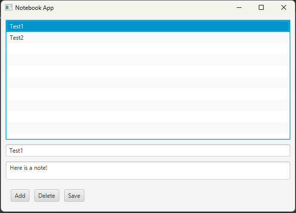

# 📝 JavaFX Not Defteri

Bu proje, **JavaFX** kullanılarak geliştirilmiş basit bir **Not Defteri Uygulaması**dır.
Kullanıcılar not ekleyebilir, silebilir ve notlarını **kalıcı olarak** (`notes.txt` dosyasında) saklayabilir.

## ✨ Özellikler

* 📌 Yeni not ekleme
* 📋 Notları listeleme
* ❌ Not silme
* 💾 Notları dosyaya kaydetme
* 🔄 Açılışta notları geri yükleme

## 📂 Proje Yapısı

```
NotDefteriFX/
 └── src/
     └── main/
         └── java/
             └── notdefteri/
                 ├── Main.java          // Giriş noktası
                 ├── Note.java          // Not veri modeli
                 ├── Notebook.java      // İş mantığı + dosya işlemleri
                 └── NotesApp.java      // JavaFX arayüzü
```

## 🛠️ Kullanılan Teknolojiler

* **Java 11+**
* **JavaFX** (GUI için)
* **OOP prensipleri**
* **File I/O** (dosya kaydetme/okuma)

## ▶️ Çalıştırma

1. Projeyi klonla:

   ```bash
   git clone https://github.com/kullaniciadi/NotDefteriFX.git
   ```
2. JavaFX kütüphanesinin kurulu olduğundan emin ol.
   Örn. IntelliJ IDEA’da **VM Options** kısmına şunu ekleyebilirsin:

   ```
   --module-path "javafx-sdk-XX/lib" --add-modules javafx.controls,javafx.fxml
   ```
3. `Main.java` dosyasını çalıştır.
4. Uygulama açıldığında not ekleyebilir, silebilir ve **Kaydet** butonuyla dosyaya yazabilirsin.

## 📸 Ekran Görüntüsü (Örnek)



## 🚀 Geliştirme Fikirleri

* 🔍 Notlarda arama özelliği
* ✏️ Not düzenleme (update)
* 🎨 Daha modern arayüz tasarımı (CSS ile)

---

👨‍💻 Hazırlayan: *Ömercan Yalçın*
